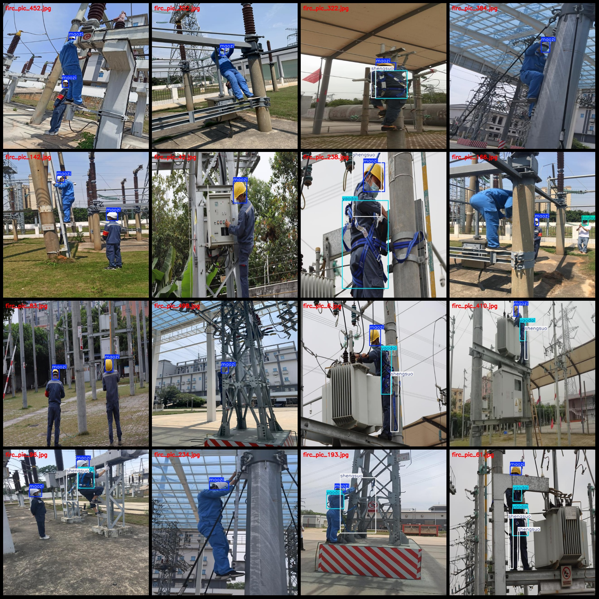
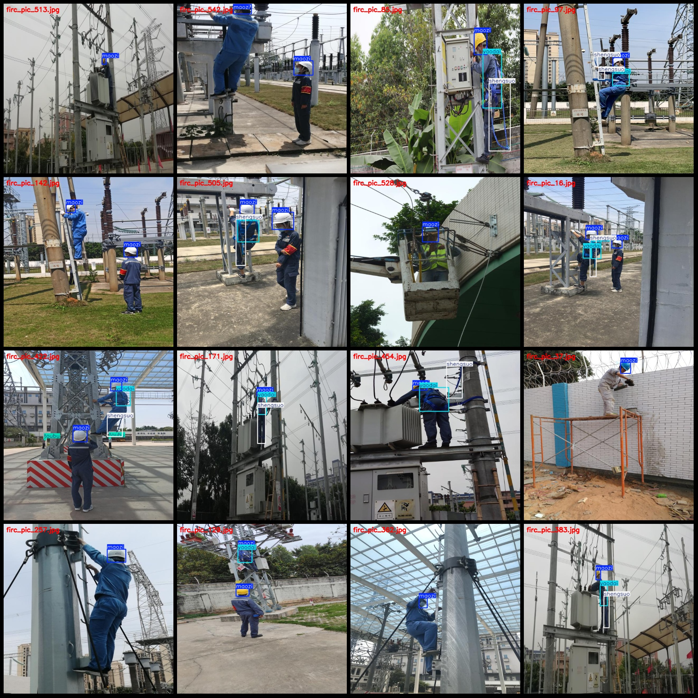

# Power Scenario High-altitude Work Cliff Climbing Safety Line and Harness Inspection Data Set VOC + YOLO format 578 categories

Dataset format: Pascal VOC format + YOLO format (without split path in txtfile, only containing jpgimage and corresponding VOC format xmlfile and yolo format txtfile)
number of images: 578  
annotation count: 578  
annotation count: 578  
annotationnumber of classes: 4  
annotation class names: ["maozi", "shengsuo", "toubu", "yaodai"]  
["hat", "rope", "head", "belt"]
boxes per class:   
maozi box count = 768  
shengsuo box count = 446  
toubu box count = 217  
yaodai box count = 444  
total boxes: 1875  
images per class:   
maozi images = 551  
shengsuo images = 339  
toubu images = 128  
yaodai images = 372  
image resolution: 640x640  
Using the annotation tool: labelImg
Annotation rules: Draw a rectangle around the class for each image.
Important notes: The dataset does not have a separate training, validation, and test set. You need to partition it yourself.
Special statement: This dataset does not guarantee any accuracy for the trained model or weight file.
Image preview:
## Images

Here is a pay link on Stripe ( https://buy.stripe.com/3cs8yP7sY87d0vu9AB ). Please contact me lonlonago@foxmail.com after funding $89, and I will send you a complete data files , thank you!

